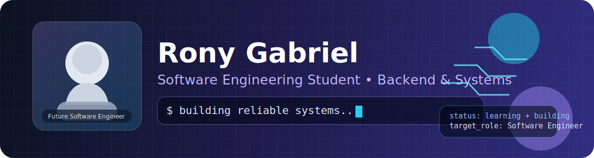

  

  

    
    
    
  

## 👋 About Me / Sobre Mim

🇧🇷 Olá! Eu sou o **Rony Gabriel**.
Sou estudante de **Engenharia de Software** e atuo como **Operador de Controle de Tráfego Portuário**.
No meu dia a dia, trabalho com operações críticas e alta responsabilidade — experiência que fortaleceu disciplina, foco, comunicação e tomada de decisão sob pressão.

🇺🇸 Hi! I'm **Rony Gabriel**.
I'm a **Software Engineering** student and currently work as a **Port Traffic Controller**.
Handling high-stakes operations helped me build strong discipline, ownership, and attention to detail — qualities I bring into software development.

---

## 🎯 Professional Goal / Objetivo Profissional

🇧🇷 Busco oportunidades para atuar com **Backend** e **programação de sistemas**, criando soluções robustas, seguras e bem estruturadas.

🇺🇸 I'm looking for opportunities in **Backend** and **Systems Programming**, focused on building robust, secure, and well-structured solutions.

---

## 🧠 Tech Stack

### Languages

### Tools & Workflow

---

## 📚 Current Studies / Estudos Atuais

- 🏗️ **Software Architecture** & Clean Code / **Arquitetura de Software** & Clean Code
- 🔐 **Security Fundamentals** and low-level analysis / **Fundamentos de Segurança** e análise de baixo nível
- 🐍 **Python automation** for productivity workflows / **Automação com Python** para fluxos de produtividade
- ⚙️ **Data structures** and performance-oriented thinking / **Estruturas de dados** e pensamento orientado a performance

---

## 🧩 Highlights / Diferenciais

- ✅ Professional experience in high-criticality environments / Experiência profissional em ambiente de alta criticidade
- ✅ Disciplined, process-oriented profile / Perfil disciplinado e orientado a processo
- ✅ Quick learner, open to feedback and continuous growth / Facilidade para aprender e evoluir com feedback
- ✅ Genuine interest in computer science fundamentals / Interesse genuíno em fundamentos de computação

---

## 📊 GitHub Analytics

  

---

## 📬 Contact / Contato

  
  

  🚀 Always open to connections, collaborations and opportunities. / Sempre aberto a conexões, colaborações e oportunidades.

